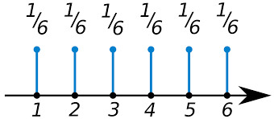
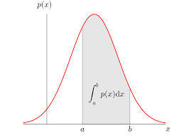
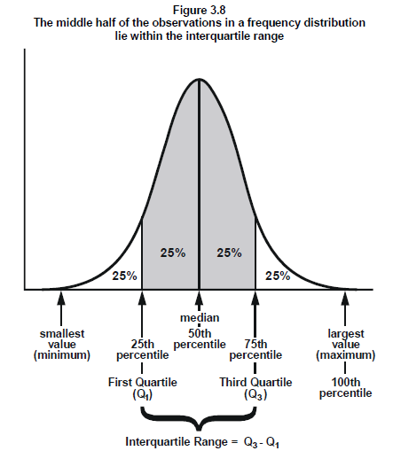
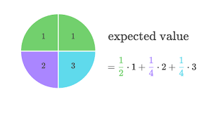
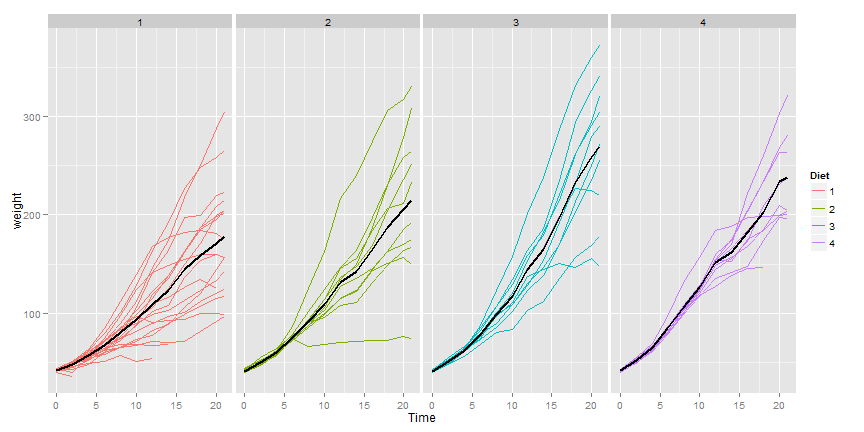

# Probability:

Probability is a measure quantifying the likelihood that events will occur.
Probability quantifies as a number between 0 and 1, where, sparsly speaking, 0 indicates impossibility and 1 indicates certainty.
The higher the probability of an event, the more likely it is that the event will occur. A simple example is the tossing of a fair (unbiased) coin. 
Since the coin is fair, the two outcomes ("heads" and "tails") are both equally probable; the probability of "heads" equals the probability of "tails"; 
and since no other outcomes are possible, the probability of either "heads" or "tails" is 1/2 (which could also be written as 0.5 or 50%)

Let A and B be two events then:

$$P(A \cup B)=P(A)+P(B)-P(A \cap B) $$

if A and B are independent events then:

$P(A\cap B)=P(A)P(B)$

## Probability Mass Function:

### Random variable:
A random variable is a numerical outcome of an experiment. Discrete or Continuous
Example : Flip of a coin (0 or 1), roll of a dice


A probability mass function evaluated at a value corresponds to the probability that a random variable takes that value.A valid pmf must satisfy:
1) $P >=0$
2) $\sum p=1$

Example: Consider rolling a fair (unbiased) dice. The probability of any face turning up is $1/6$.


## Probability Density Function:
A probability density function (pdf) is a function associated  with a continuous random variable.
A valid pdf must satisfy:
1) $$p(x)>=0$$ everywhere
2) $$ \int p(x)dx=1 $$
Total area under the curve is equal to $1$.
Area under pdf correspond to probability for that random variable.


### Cumulative Distribution Function & Survival Function:
Cumulative Distribution Function (CDF) of a random variable $X$, returns the probability that the random variable is less than or equal to the value $x$
$F(x)=P(X<=x)$


Survivial function of a random variable $X$, returns the probability that the random variable is more than the value $x$
$F(x)=P(X>x)$

### Quantiles & Quartiles:
In statistics and probability quantiles are cut points dividing the range of a probability distribution into continuous intervals with equal probabilities, or dividing the observations in a sample in the same way. There is one fewer quantile than the number of groups created. Thus quartiles are the three cut points that will divide a dataset into four equal-sized groups. 
A quartile is a type of quantile. The first quartile (Q1) is defined as the middle number between the smallest number and the median of the data set. The second quartile (Q2) is the median of the data. The third quartile (Q3) is the middle value between the median and the highest value of the data set. 



# Conditional Probability:

The probability of an event A, given that another B has already occurred.
$P(A/B)=\frac {P(A\cap B)}{P(B)}$ 
If A and B are independent:
$P(A/B)=P(A)$

## Bayes Theorem:
Bayes’ theorem describes the probability of an event, based on prior knowledge of conditions that might be related to the event. 
For example, if cancer is related to age, then, using Bayes theorem, a person's age can be used to more accurately assess the probability that they have cancer, compared to the assessment of the probability of cancer made without knowledge of the person’s age. 


$P(B/A)=\frac {P(A/B)P(B)}{P(A/B)P(B)+P(A/B')P(B')}$

For instance, let $+$ and $-$ be the events that the result of a diagnostic test is Positive or Negative respectively.
Let D and D' be the events that the subject has or does not have the disease respectively.
Then,
Sensitivity = $P(+/D)$ = $\frac {TP}{TP+FN}$
Specificity = $P(-/D')$ = $\frac {TN}{TN+FP}$
Positive Predicted Value = $P(D/+)$
Negative Predicted Value = $P(D'/-)$

### Likelihood ratio:
Likelihood ratios are used for assessing the value of performing a diagnostic test. They use the sensitivity and specificity of the test to determine whether a test result usefully changes the probability that a condition exists. 
$\frac{P(D/+)}{P(D'/+)}$=$\frac{P(+/D)}{P(+/D')}$ x $\frac{P(D)}{P(D')}$ <br />
i.e. <br />
Post-test-odds= DLR+ x Pre-test-odds
DLR+ = $\frac {Sensitivity}{1-Specificity}$
This means if DLR+ is 50 then, given the test is positive the probability of disease increases by 50 times than before the test.
Similarly,
DLR- = $\frac {1-Sensitivity}{Specificity}$
This means if DLR- is 0.003 then, given the test is negative the probability of disease changes by 0.003 times than before the test.


## Expected Values:
In probability theory, the expected value of a random variable is the long-run average value of repetitions of the same experiment it represents. For example, the expected value in rolling a six-sided die is 3.5, because the average of all the numbers that come up is 3.5 as the number of rolls approaches infinity.
The **expected value** or **mean** of a random variable is the center of its distribution

For discrete random variable $X$ with PMF $p(x)$, it is defined as follows
$$
E[X] = \sum_x xp(x).
$$
$E[X]$ represents the center of mass of a collection of locations and weights, $\{x, p(x)\}$


  
Suppose a coin is flipped and $X$ is declared $0$ or $1$ corresponding to a head or a tail, respectively
What is the expected value of $X$? 
$$
E[X] = .5 \times 0 + .5 \times 1 = .5
$$

```{r, echo = FALSE, fig.height=3.5, fig.width = 3.5, fig.align='center'}
barplot(height = c(.5, .5), names = c(0, 1), border = "black", col = "lightblue", space = .75)
```

Suppose that a die is rolled and $X$ is the number face up
What is the expected value of $X$?
$$
E[X] = 1 \times \frac{1}{6} + 2 \times \frac{1}{6} +
3 \times \frac{1}{6} + 4 \times \frac{1}{6} +
5 \times \frac{1}{6} + 6 \times \frac{1}{6} = 3.5
$$


### Continous random vairalbe expected values:
For a continuous random variable, $X$, with density, $f$, the expected
value is defined as follows
$$
E[X] = \mbox{the area under the function}~~~ t f(t)
$$

Consider a density where $f(x) = 1$ for $x$ between zero and one
Suppose that $X$ follows this density; what is its expected value?  
**0.5** <br />
```{r, fig.height=4, fig.width=8, echo=FALSE}
plot(c(-0.25, 0, 0, 1, 1, 1.25), c(0, 0, 1, 1, 0, 0), type = "l", lwd = 3, frame = FALSE, xlab="", ylab = ""); title('f(t)')
```

# Variance:
The variance of a random variable is a measure of its spread.
If $X$ is a random variable with mean $\mu$, the variance of $X$ is defined as

$$Var(X) = E[(X - \mu)^2]$$

the expected (squared) distance from the mean

$$Var(X) = E[X^2] - E[X]^2$$

The square root of the variance is called the **standard deviation**.

What's the sample variance from the result of a toss of a die? 

$ E[X] = 3.5 $ 
$$
E[X^2] = 1 ^ 2 \times \frac{1}{6} + 2 ^ 2 \times \frac{1}{6} + 3 ^ 2 \times \frac{1}{6} + 4 ^ 2 \times \frac{1}{6} + 5 ^ 2 \times \frac{1}{6} + 6 ^ 2 \times \frac{1}{6} = 15.17
$$

$Var(X) = E[X^2] - E[X]^2 \approx 2.92$

What's the sample variance from the result of the toss of a coin with probability of heads (1) of $p$? 
$E[X] = 0 \times (1 - p) + 1 \times p = p$
$E[X^2] = E[X] = p$ 
$Var(X) = E[X^2] - E[X]^2 = p - p^2 = p(1 - p)$

## Standard Error:
The standard error (SE) of a statistic (usually an estimate of a parameter) is the standard deviation of its sampling distribution[1] or an estimate of that standard deviation. If the parameter or the statistic is the mean, it is called the standard error of the mean (SEM). 
The variance of sample mean is $\frac{\sigma^2}{n}$.
Its logical estimate is $\frac{s^2}{n}$
The standard error of the mean: $\frac{s}{\sqrt{n}}$
Here,
S,the standard deviation, talks about how variable the population is
$\frac{S}{\sqrt{n}}$ talks about how variable the averages of random samples of size n from population are.


# Common Distributions:

A probability distribution is a mathematical function that provides the probabilities of occurrence of different possible outcomes in an experiment.

## Binomial Distribution:
The **Bernoulli distribution** arises as the result of a binary outcome

- Bernoulli random variables take only the values 1 and 0 with probabilities of $p$ and $1-p$ respectively

- The PMF for a Bernoulli random variable $X$ is $$P(X = x) =  p^x (1 - p)^{1 - x}$$

- The mean of a Bernoulli random variable is $p$ and the variance is $p(1 - p)$

- If we let $X$ be a Bernoulli random variable, it is typical to call $X=1$ as a "success" and $X=0$ as a "failure"

The *binomial random variables* are obtained as the sum of iid Bernoulli trials

- In specific, let $X_1,\ldots,X_n$ be iid Bernoulli$(p)$; then $X = \sum_{i=1}^n X_i$ is a binomial random variable

- The binomial mass function is

$$P(X = x) = \left(\begin{array}{c}n \\ x\end{array}\right)p^x(1 - p)^{n-x}$$

for $x=0,\ldots,n$


- Suppose a friend has $8$ children (oh my!), $7$ of which are girls and none are twins

- If each gender has an independent $50$% probability for each birth, what's the probability of getting $7$ or more girls out of $8$ births?

$$\left(\begin{array}{c}8 \\ 7\end{array}\right) .5^{7}(1-.5)^{1}+\left(\begin{array}{c}8 \\ 8\end{array}\right) .5^{8}(1-.5)^{0} \approx 0.04$$

```{r}
choose(8, 7) * .5 ^ 8 + choose(8, 8) * .5 ^ 8 

pbinom(6, size = 8, prob = .5, lower.tail = FALSE)
```


## The normal distribution
- A random variable is said to follow a **normal** or **Gaussian** distribution with mean $\mu$ and variance $\sigma^2$ if the associated density is
$$(2\pi \sigma^2)^{-1/2}e^{-(x - \mu)^2/2\sigma^2}$$

  If $X$ a RV with this density then $E[X] = \mu$ and $Var(X) = \sigma^2$

- We write $X\sim \mbox{N}(\mu, \sigma^2)$

- When $\mu = 0$ and $\sigma = 1$ the resulting distribution is called **the standard normal distribution**

- The standard normal density function is labeled $\phi$

- Standard normal RVs are often labeled $Z$


---

```{r,warning=F,message=F,error=F,results=F, fig.height=4.5, fig.width=4.5}

zvals <- seq(-3, 3, length = 1000)

plot(zvals, dnorm(zvals), 

     type = "l", lwd = 3, frame = FALSE, xlab = "z", ylab = "Density")

sapply(-3 : 3, function(k) abline(v = k))

```


#### Facts about the normal density


- If $X \sim \mbox{N}(\mu,\sigma^2)$ the $Z = \frac{X -\mu}{\sigma}$ is standard normal

- If $Z$ is standard normal $$X = \mu + \sigma Z \sim \mbox{N}(\mu, \sigma^2)$$

- The non-standard normal density is $$\phi\{(x - \mu) / \sigma\}/\sigma$$

1. Approximately $68\%$, $95\%$ and $99\%$  of the normal density lies within $1$, $2$ and $3$ standard deviations from the mean, respectively

2. $-1.28$, $-1.645$, $-1.96$ and $-2.33$ are the $10^{th}$, $5^{th}$, $2.5^{th}$ and $1^{st}$ percentiles of the standard normal distribution respectively

3. By symmetry, $1.28$, $1.645$, $1.96$ and $2.33$ are the $90^{th}$, $95^{th}$, $97.5^{th}$ and $99^{th}$ percentiles of the standard normal distribution respectively

---

## The Poisson distribution

* Used to model counts

* The Poisson mass function is

$$P(X = x; \lambda) = \frac{\lambda^x e^{-\lambda}}{x!}$$

for $x=0,1,\ldots$

* The mean of this distribution is $\lambda$

* The variance of this distribution is $\lambda$

* Notice that $x$ ranges from $0$ to $\infty$


---

## Some uses for the Poisson distribution

* Modeling event/time data

* Modeling radioactive decay

* Modeling survival data

* Modeling unbounded count data 

* Modeling contingency tables

* Approximating binomials when $n$ is large and $p$ is small


Poisson random variables are used to model rates

$X \sim Poisson(\lambda t)$ where 
$\lambda = E[X / t]$ is the expected count per unit of time
$t$ is the total monitoring time


## Central Limit Theorm & Law of Large Numbers:
In probability theory, the central limit theorem (CLT) establishes that, in some situations, when independent random variables are added, their properly normalized sum tends toward a normal distribution (a "bell curve") even if the original variables themselves are not normally distributed.


The law of large numbers (LLN) is a theorem that describes the result of performing the same experiment a large number of times. According to the law, the average of the results obtained from a large number of trials should be close to the expected value, and will tend to become closer as more trials are performed. 
```{r, fig.height=4, fig.width=4}
n <- 10000; means <- cumsum(rnorm(n)) / (1  : n)
plot(1 : n, means, type = "l", lwd = 2, frame = FALSE, ylab = "cumulative means", xlab = "sample size")
abline(h = 0)
```


# Confidence Intervals:

In statistics, a confidence interval (CI) is a type of interval estimate, computed from the statistics of the observed data, that might contain the true value of an unknown population parameter.

- Therefore, according to the CLT, the probability that the random interval 
$$\bar X_n \pm z_{1-\alpha/2}\times\sigma / \sqrt{n}$$ contains $\mu$ is approximately 100$(1-\alpha)$%, where $z_{1-\alpha/2}$ is the $1-\alpha/2$ quantile of the standard normal distribution

- This is called a $100(1 - \alpha)$% **confidence interval** for $\mu$

- We can replace the unknown $\sigma$ with $s$

## Poisson interval

* A nuclear pump failed 5 times out of 94.32 days, give a 95% confidence interval for the failure rate per day?

* $X \sim Poisson(\lambda t)$.

* Estimate $\hat \lambda = X/t$

* $Var(\hat \lambda) = \lambda / t$ 

```{r}

x <- 5; t <- 94.32; lambda <- x / t

round(lambda + c(-1, 1) * qnorm(.975) * sqrt(lambda / t), 3)

poisson.test(x, T = 94.32)$conf

```
## The Chi-squared distribution


- Suppose that $S^2$ is the sample variance from a collection of iid $N(\mu,\sigma^2)$ data; then 

$$\frac{(n - 1) S^2}{\sigma^2} \sim \chi^2_{n-1}$$

which reads: follows a Chi-squared distribution with $n-1$ degrees of freedom

- The Chi-squared distribution is skewed and has support on $0$ to $\infty$

- The mean of the Chi-squared is its degrees of freedom 

- The variance of the Chi-squared distribution is twice the degrees of freedom


---


## Gosset's $t$ distribution

In probability and statistics, Student's t-distribution is any member of a family of continuous probability distributions that arises when estimating the mean of a normally distributed population in situations where the sample size is small and population standard deviation is unknown.

- Invented by William Gosset (under the pseudonym "Student") in 1908

- Has thicker tails than the normal

- Is indexed by a degrees of freedom; gets more like a standard normal as df gets larger

- Is obtained as 

$$\frac{Z}{\sqrt{\frac{\chi^2}{df}}}$$

where $Z$ and $\chi^2$ are independent standard normals and

Chi-squared distributions respectively


$$\frac{\bar X - \mu}{S/\sqrt{n}}$$

follows Gosset's $t$ distribution with $n-1$ degrees of freedom.


## Note's about the $t$ interval


- The $t$ interval technically assumes that the data are iid normal, though it is robust to this assumption

- It works well whenever the distribution of the data is roughly symmetric and mound shaped

- Paired observations are often analyzed using the $t$ interval by taking differences

- For large degrees of freedom, $t$ quantiles become the same as standard normal quantiles; therefore this interval converges to the same interval as the CLT yielded

- For skewed distributions, the spirit of the $t$ interval assumptions are violated

- Also, for skewed distributions, it doesn't make a lot of sense to center the interval at the mean

- In this case, consider taking logs or using a different summary like the median

- For highly discrete data, like binary, other intervals are available


---

In R typing data(sleep) brings up the sleep data originally analyzed in Gosset's Biometrika paper, which shows the increase in hours for 10 patients on two soporific drugs. R treats the data as two groups rather than paired.
```{r,echo=T,result=F}
head(sleep)
g1 <- sleep$extra[1 : 10]; g2 <- sleep$extra[11 : 20]

difference <- g2 - g1

mn <- mean(difference); s <- sd(difference); n <- 10

mn + c(-1, 1) * qt(.975, n-1) * s / sqrt(n)

```

### If the groups are independent:

```{r}
t.test(g2,g1,paired=F,var.equal = T)$conf.int
t.test(g2,g1,paired=F,var.equal=F)$conf.int
```

### If the groups are dependent/paired:

```{r}
t.test(g2,g1,paired=T)$conf.int 

t.test(difference)$conf.int

```


A lot of variance is explained by grouping the two groups. Pairing of independent groups can hence really mess things up!.

# Example: independent groups t-test.
```{r,results=F,warning=F,message=F}
library(datasets); data(ChickWeight); library(reshape2)
##define weight gain or loss
wideCW <- dcast(ChickWeight, Diet + Chick ~ Time, value.var = "weight")
names(wideCW)[-(1 : 2)] <- paste("time", names(wideCW)[-(1 : 2)], sep = "")
library(dplyr)
wideCW <- mutate(wideCW,
  gain = time21 - time0
)
```



Now let’s do a t interval comparing groups 1 and 4. We’ll show the two intervals, one assuming that the variances are equal and one assuming otherwise.
```{r}
wideCW14 <- subset(wideCW, Diet %in% c(1, 4))
rbind(
  t.test(gain ~ Diet, paired = FALSE, var.equal = TRUE, data = wideCW14)$conf,
  t.test(gain ~ Diet, paired = FALSE, var.equal = FALSE, data = wideCW14)$conf
)
```

For the time being, let’s interpret the equal variance interval. Since the interval is entirely below zero it suggest that group 1 had less weight gain than group 4 (at 95% confidence).


# Hypothesis testing:

Hypothesis testing is concerned with making decisions using data.
* Deciding between two hypotheses is a core activity in scientific discovery. Statistical hypothesis        testing is the formal inferential framework around choosing between hypotheses. 

* A null hypothesis is specified that represents the status quo, usually labeled $H_0$

* The null hypothesis is assumed true and statistical evidence is required to reject it in favor of a research or alternative hypothesis.

## Example

* A respiratory disturbance index of more than $30$ events / hour, say, is 

  considered evidence of severe sleep disordered breathing (SDB).

* Suppose that in a sample of $100$ overweight subjects with other

  risk factors for sleep disordered breathing at a sleep clinic, the

  mean RDI was $32$ events / hour with a standard deviation of $10$ events / hour.

* We might want to test the hypothesis that 

  * $H_0 : \mu = 30$

  * $H_a : \mu > 30$

  * where $\mu$ is the population mean RDI.


## Hypothesis testing

* The alternative hypotheses are typically of the form $<$, $>$ or $\neq$

* Note that there are four possible outcomes of our statistical decision process


Truth | Decide | Result |
--- | --- | --- |
$H_0$ | $H_0$ | Correctly accept nul: True Positivel |
$H_0$ | $H_a$ | Type I error: False Positive |
$H_a$ | $H_a$ | Correctly reject null:True Negative |
$H_a$ | $H_0$ | Type II error: False Negative |


A reasonable strategy would be to reject the null hypothesis if$\bar X$ was larger than some constant, say $C$

Typically, $C$ is chosen so that the probability of a Type I error, $\alpha$, is $.05$ (or some other relevant constant)

$\alpha$ = Type I error rate = Probability of rejecting the null hypothesis when, in fact, the null       hypothesis is correct

* For $\alpha=0.05$, 95th percentile of Normal Distribution is 1.645 sd away from the mean.
* We would just reject $H_0$ because the Z-score: 
$$\frac{32 - 30}{10 / \sqrt{100}} = 2$$ is greater than $1.645$
* Or, whenever $\sqrt{n} (\bar X - \mu_0) / s > Z_{1-\alpha}$

* The $Z$ test for $H_0:\mu = \mu_0$ versus 
  * $H_1: \mu < \mu_0$
  * $H_2: \mu \neq \mu_0$
  * $H_3: \mu > \mu_0$ 
  * Test statistic $$TS = \frac{\bar{X} - \mu_0}{S / \sqrt{n}}$$

In General, Reject the null hypothesis when 

* $TS \leq -Z_{1 - \alpha}$
* $|TS| \geq Z_{1 - \alpha / 2}$  (Two sided test)
* $TS \geq Z_{1 - \alpha}$

# T Hypothesis Test:
Consider our example again. Suppose that $n= 16$ (rather than
$100$). Then consider that

$$.05 = P\left(\frac{\bar X - 30}{s / \sqrt{16}} \geq t_{1-\alpha, 15} ~|~ \mu = 30 \right)$$

- So that our test statistic is now $$\sqrt{16}(32 - 30) / 10 = 0.8 $$, while the critical value is $$t_{1-\alpha, 15} = 1.75$$

-Since our Test Statitic,0.8 < 1.75, We now fail to reject.


## Two sided tests:
* Suppose,Now that we would reject the null hypothesis if in fact the 

  mean was too large or too small

* That is, we want to test the alternative $H_a : \mu \neq 30$

* Then note

$$ \alpha = P\left(\left. \left|\frac{\bar X - 30}{s /\sqrt{16}}\right| > t_{1-\alpha/2,15} ~\right|~ \mu = 30\right) $$

* That is we will reject if the test statistic, $0.8$, is either

  too large or too small, but the critical value is calculated using

  $\alpha / 2$

* In our example the critical value is $2.13$, so we fail to reject since $0.8 < 2.13$.


## T test in R:

```{r,warnings=F,result=F,error=F,message=F}

library(UsingR); data(father.son)

t.test(father.son$sheight - father.son$fheight)

```

Notice R gives us a P-value.P-values are a convenient way to communicate the results of a hypothesis test. When communicating a P-value, the reader can perform the test at whatever Type I error rate that they would like. Just compare the P-value to the desired Type I error rate and if the P-value is smaller, reject the null hypothesis. 

  * P values can be used against the type I error rate $\alpha$ to reject or accept $H_0$.
  * A p-value indicates the probability under the Null Hypothesis of obtaining evidence as extreme or more extreme as we did.So, a small p value would indicate that either we observed a rare event or our $H_0$ is incorrect.
  * Therefore, If $$p < \alpha $$, we reject the null hypothesis, else we fail to reject.

## P-value example 1: (Binomial)
Suppose, a friend has 8 children, 7 of which are girls and none are twins.
If each gender has an independent probability of 50% of each birth, what's the probabilty of getting 7 or more girls out of 8 births?
Let our Null Hypothesis $H_0$ be that both genders have equal probability of birth. And $H_a$ be that probability of a girl birth is more that probability of a boy birth. Then, 
```{r}
pbinom(6,size=8,prob=0.5,lower.tail=F)
```

So, around 3.5% chance of 7 or more girls out of 8. If we set our alpha level to be 0.05. 
0.035 < 0.05. Hence we reject $H_0$. Therefore, P(girl birth) > P(boy birth).


## P-value example 2: (Poisson)

Suppose that a hospital has an infection rate of 10 infections per 100 person/days at risk (rate=0.1). during the last month period.
Assume that an infection rate of 0.05 is an important benchmark.So if rate goes above that they would implenent some quality control procedures.
Should the hospital get the expensive quality control procedures done?
The key question is: what's the probabilty of obtaining 10 or more infection per 100 person/days given rate of infection 0.05?
Under: $H_0$ : $\lambda=0.5$ so that $\lambda*100$=5.
Consider $H_a$: $\lambda>0.05$

```{r}
ppois(9,0.05*100,lower.tail = F)
```
p-value : 0.03183. i.e. 3%
    $$p=0.031<0.05$$
  * Therefore it's unlikely for us to have seen as many as 10 infects per 100 person/day at risk if the real infection rate was 5 infections per 100 person/day. So the hospital probably should get the quality control procedures done.
  
  
  
